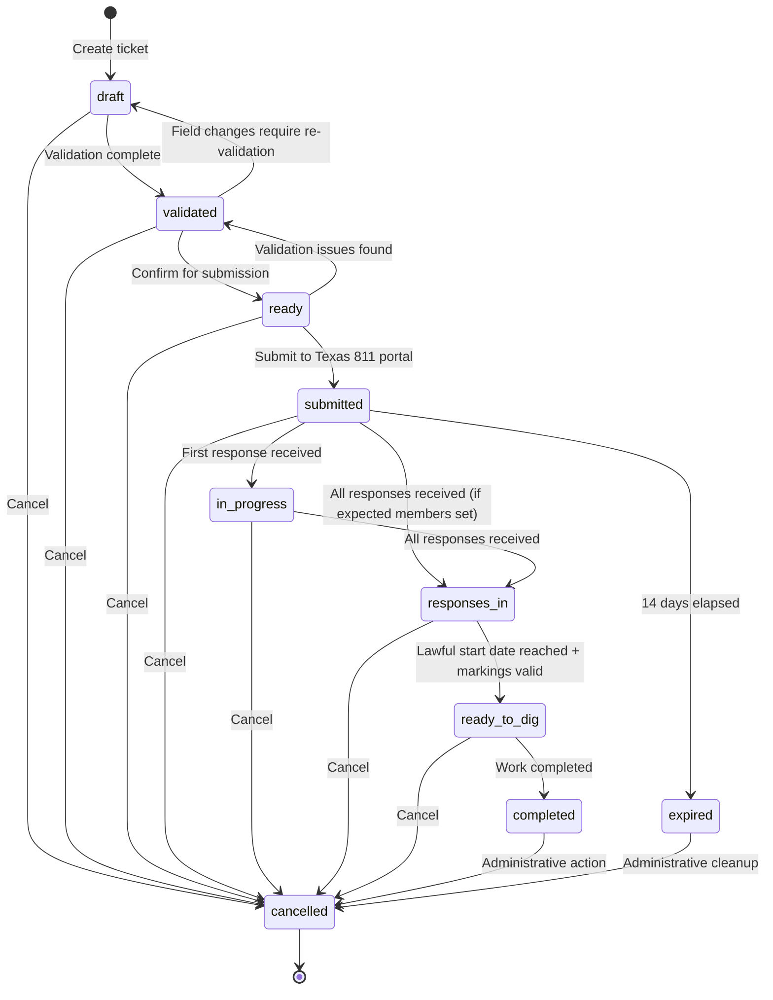

# Texas 811 POC - Ticket Lifecycle Documentation

> **Version:** 1.0  
> **Last Updated:** December 2024  
> **System:** Texas 811 POC Backend API  

## Overview

The Texas 811 POC system manages utility locate request tickets through a comprehensive lifecycle that spans from initial creation through work completion. This document provides a complete overview of the ticket states, transitions, business rules, and system behaviors throughout this lifecycle.

## Ticket Lifecycle States

The system implements 9 distinct ticket statuses as defined in the `TicketStatus` enum:

### 1. **DRAFT** (`draft`)
- **Purpose**: Initial ticket creation with partial data
- **Behavior**: Allows all field updates; no restrictions
- **Duration**: Until validation is completed
- **Next Actions**: Complete required fields and validate

### 2. **VALIDATED** (`validated`) 
- **Purpose**: All required fields present and valid
- **Behavior**: Location fields locked to prevent major changes after validation
- **Duration**: Until ticket is confirmed as ready for submission
- **Next Actions**: Review and confirm ticket for submission

### 3. **READY** (`ready`)
- **Purpose**: Ticket confirmed and ready for Texas 811 portal submission
- **Behavior**: Core fields locked (location + work description)
- **Duration**: Until manually submitted to Texas 811
- **Next Actions**: Submit ticket to Texas 811 portal

### 4. **SUBMITTED** (`submitted`)
- **Purpose**: Ticket has been submitted to Texas 811 system
- **Behavior**: All core fields locked; compliance dates calculated
- **Duration**: Until utility member responses are received (up to 14 days)
- **Next Actions**: Wait for utility member responses

### 5. **IN_PROGRESS** (`in_progress`)
- **Purpose**: Some but not all expected utility member responses received
- **Behavior**: Same field locking as SUBMITTED status
- **Duration**: Until all expected responses are received
- **Next Actions**: Continue waiting for remaining responses

### 6. **RESPONSES_IN** (`responses_in`)
- **Purpose**: All expected utility member responses have been received
- **Behavior**: Extensive field locking; ready for work authorization
- **Duration**: Until lawful start date is reached with valid markings
- **Next Actions**: Wait for lawful start date; verify markings are valid

### 7. **READY_TO_DIG** (`ready_to_dig`)
- **Purpose**: Work can legally begin - lawful start date reached and markings valid
- **Behavior**: All fields locked except completion tracking
- **Duration**: Until work is completed or ticket expires
- **Next Actions**: Begin excavation work

### 8. **COMPLETED** (`completed`)
- **Purpose**: Work has been completed successfully
- **Behavior**: All fields permanently locked
- **Duration**: Terminal state (can only transition to CANCELLED)
- **Next Actions**: Archive or cancel if needed

### 9. **EXPIRED** (`expired`)
- **Purpose**: Ticket exceeded 14-day validity period without completion
- **Behavior**: All fields locked; requires new ticket for work
- **Duration**: Terminal state (can only transition to CANCELLED)
- **Next Actions**: Create new ticket if work still needed

### 10. **CANCELLED** (`cancelled`)
- **Purpose**: Ticket cancelled at any point in lifecycle
- **Behavior**: All fields permanently locked
- **Duration**: Final terminal state
- **Next Actions**: None (ticket is permanently closed)

## State Transition Matrix

The following table shows all valid state transitions in the system:

| From Status | Valid Next States | Trigger Conditions |
|------------|------------------|-------------------|
| `draft` | `validated`, `cancelled` | Validation completion or manual cancellation |
| `validated` | `ready`, `draft`, `cancelled` | Confirmation, field changes requiring re-validation, or cancellation |
| `ready` | `submitted`, `validated`, `cancelled` | Portal submission, validation issues, or cancellation |
| `submitted` | `responses_in`, `in_progress`, `expired`, `cancelled` | Response tracking, expiration, or cancellation |
| `in_progress` | `responses_in`, `cancelled` | All responses received or cancellation |
| `responses_in` | `ready_to_dig`, `cancelled` | Lawful start date + valid markings, or cancellation |
| `ready_to_dig` | `completed`, `cancelled` | Work completion or cancellation |
| `completed` | `cancelled` | Administrative cancellation only |
| `expired` | `cancelled` | Administrative cleanup only |
| `cancelled` | _(none)_ | Terminal state |

## State Transition Diagram

## Field Locking Rules

The system implements progressive field locking to maintain data integrity as tickets advance through the lifecycle:

### No Locking (DRAFT)
- All fields can be updated freely
- Supports iterative data completion

### Location Locking (VALIDATED)
**Locked Fields:**
- `county`, `city`, `address`, `cross_street`
- `gps_lat`, `gps_lng`

### Core Work Locking (READY)  
**Locked Fields (adds to VALIDATED):**
- `work_description`, `work_type`

### Comprehensive Locking (SUBMITTED, IN_PROGRESS, RESPONSES_IN, READY_TO_DIG)
**Locked Fields (adds to READY):**
- All caller information: `caller_name`, `caller_company`, `caller_phone`, `caller_email`
- All excavator information: `excavator_company`, `excavator_address`, `excavator_phone`
- Work timing: `work_start_date`, `work_duration_days`
- Additional locking for later states: `submitted_at`

### Total Locking (COMPLETED, CANCELLED, EXPIRED)
- **All fields locked** (indicated by `"*"` in system)
- Only status updates permitted for administrative actions

## Business Rules and Timing

### Texas 811 Compliance Requirements

1. **2 Business Day Wait Period**
   - Work cannot begin until at least 2 business days after submission
   - Calculated using Texas business days (excluding weekends and state holidays)
   - `lawful_start_date` field automatically calculated on submission

2. **14-Day Ticket Validity**
   - Tickets expire exactly 14 calendar days after submission
   - `ticket_expires_date` field automatically calculated on submission
   - Expired tickets transition to `expired` status

3. **14-Day Marking Validity**
   - Utility markings are valid for 14 calendar days from positive response
   - `marking_valid_until` field calculated when responses received
   - Expired markings require re-marking before work can begin

### Response Tracking Logic

The system supports two response tracking modes:

#### Legacy Mode (No Expected Members)
- Any response transitions `submitted` → `responses_in`
- Simpler workflow for basic use cases

#### Enhanced Mode (With Expected Members)
- `submitted` → `in_progress` when first response received
- `in_progress` → `responses_in` when all expected responses received
- Supports comprehensive tracking of specific utility members

### Automatic Status Calculation

The system includes automatic status transitions based on business rules:

1. **Expiration Detection**: Tickets automatically transition to `expired` when 14-day period elapses
2. **Ready to Dig Assessment**: `responses_in` tickets automatically transition to `ready_to_dig` when:
   - Lawful start date has passed (`can_start_work = true`)
   - Markings are still valid (`markings_valid = true`)

## API Integration Points

### Ticket Creation
- **Endpoint**: `POST /tickets/create`
- **Initial Status**: `draft`
- **Behavior**: Accepts partial data; returns validation gaps

### Iterative Updates  
- **Endpoint**: `POST /tickets/{ticket_id}/update`
- **Status Changes**: `draft` ↔ `validated` based on validation results
- **Behavior**: Progressive field completion with gap analysis

### Confirmation
- **Endpoint**: `POST /tickets/{ticket_id}/confirm`  
- **Status Transition**: `validated` → `ready`
- **Behavior**: Final validation and submission packet generation

### Manual Status Updates (Dashboard)
- **Submit**: `ready` → `submitted`
- **Mark Responses In**: `submitted`/`in_progress` → `responses_in`
- **Cancel**: Any status → `cancelled`

## Session Management

The system maintains stateful sessions to support multi-turn conversations:

- **Session Duration**: 1 hour sliding window
- **Session Storage**: Redis-based with ticket state tracking
- **Session Data**: Validation progress, field completion status, conversation context
- **Integration**: Designed for CustomGPT multi-turn interactions

## Audit Trail

Every ticket maintains a comprehensive audit trail:

- **Status Changes**: All transitions logged with user, timestamp, and reason
- **Field Updates**: Complete change history for all field modifications  
- **Validation Events**: Record of validation attempts and results
- **Submission Events**: Portal submission tracking and confirmation

## Error Handling

### State Transition Errors
- **StateTransitionError**: Thrown for invalid state transitions
- **FieldLockError**: Thrown when attempting to modify locked fields
- **ValidationError**: Thrown for business rule violations

### Recovery Mechanisms
- **Backwards Transitions**: Limited support for returning to earlier states (e.g., `validated` → `draft`)
- **Manual Overrides**: Dashboard provides manual status update capabilities
- **Session Recovery**: Lost sessions can be restored from persistent ticket state

## Performance Considerations

- **Response Time**: Target <500ms for all validation endpoints
- **Geocoding Cache**: Results cached for 24 hours to improve performance  
- **Session TTL**: 1-hour sliding window balances memory usage with user experience
- **Status Calculation**: Optimized for real-time dashboard updates

## Integration with CustomGPT

The ticket lifecycle is specifically designed to support conversational AI interactions:

1. **Iterative Data Collection**: Support for multiple API calls to build complete ticket data
2. **Validation Feedback**: Detailed gap analysis provides conversation prompts for CustomGPT
3. **Progress Tracking**: Clear completion indicators help guide conversation flow
4. **Error Recovery**: Graceful handling of incomplete or incorrect data

## Compliance and Legal Considerations

The system is designed to ensure full compliance with Texas 811 legal requirements:

- **Lawful Timing**: Automatic calculation of compliant start dates
- **Documentation**: Complete audit trail for regulatory compliance
- **Data Integrity**: Progressive field locking prevents accidental modifications
- **Expiration Handling**: Automatic enforcement of 14-day validity periods

## Dashboard Features

The dashboard provides comprehensive lifecycle management:

- **Status Overview**: Visual indicators for all ticket states
- **Countdown Timers**: Real-time tracking of deadlines and milestones
- **Manual Actions**: Support for status updates not handled automatically
- **Compliance Monitoring**: Alerts for approaching deadlines or expired elements

---

This lifecycle documentation reflects the system as currently implemented and tested. The architecture supports the complete workflow from PDF extraction through work completion while maintaining full compliance with Texas 811 regulations and providing an excellent user experience through CustomGPT integration.
