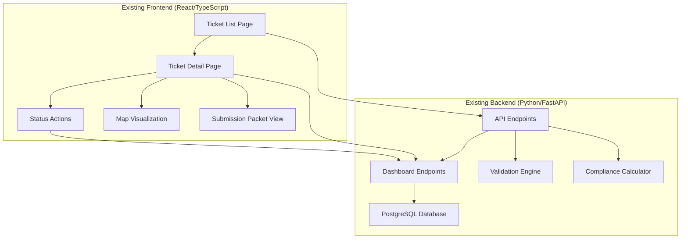
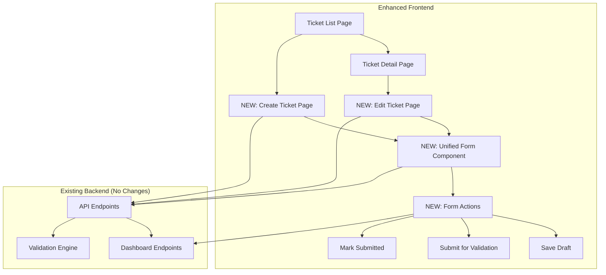
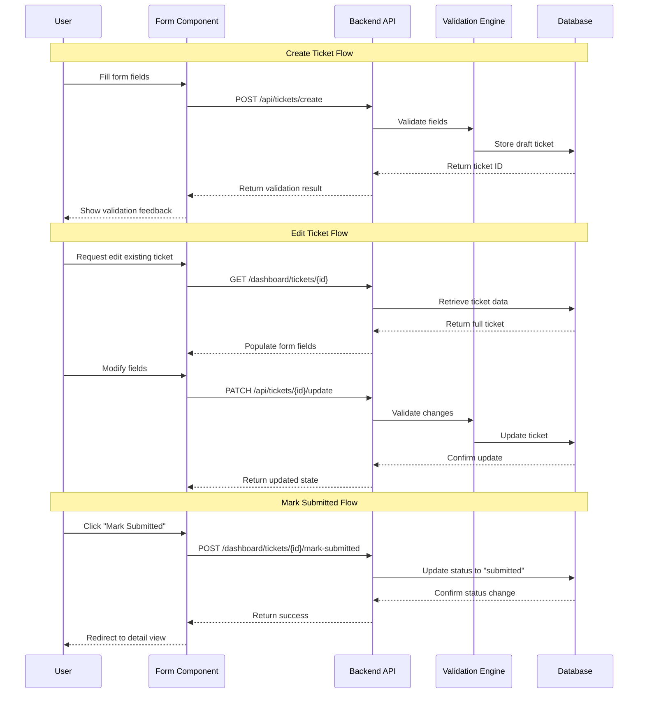

# Technical Requirements Document

# Texas811 POC UI Enhancement Implementation

**Document Version**: 1.0
**Created**: 2025-01-09
**Status**: Final
**PRD Reference**: @docs/PRD/texas811-poc-ui-enhancement.md

## 1. Executive Summary

This TRD defines the technical implementation approach for three critical UI enhancements to the Texas811 POC system:

1. **Unified Create/Edit Ticket Component**: Single React component handling both ticket creation and editing
2. **API-to-UI Workflow Integration**: Seamless transition from CustomGPT-initiated tickets to UI editing
3. **In-Edit Manual Status Management**: Direct ticket submission capability within the edit interface

The implementation leverages the existing robust backend infrastructure and follows established frontend patterns, requiring zero backend changes while significantly improving user workflow efficiency.

## 2. System Context & Architecture

### 2.1 Current System Architecture



### 2.2 Enhanced Architecture



### 2.3 Technical Stack Analysis

**Backend (No Changes Required)**:
- Python 3.12 with FastAPI framework
- PostgreSQL database with JSON storage
- Comprehensive validation engine
- Texas811 compliance calculator
- Existing API endpoints fully functional

**Frontend (Enhancement Target)**:
- React 18 with TypeScript
- Next.js App Router
- Tailwind CSS with shadcn/ui components
- Zod for validation schemas
- Real backend integration (no mock data)

### 2.4 Key Constraints

- **Zero Backend Changes**: All enhancements must use existing API endpoints
- **Pattern Consistency**: Follow established UI/UX patterns from existing dashboard
- **Type Safety**: Maintain TypeScript coverage and type definitions
- **Performance**: No degradation to existing dashboard functionality
- **Accessibility**: WCAG 2.1 AA compliance maintained

## 3. Component Architecture Design

### 3.1 Unified Form Component Structure

```typescript
// Component Hierarchy
TicketFormComponent
├── FormProvider (React Hook Form)
├── FormFieldsSection
│   ├── ExcavatorInfoSection
│   ├── WorkDetailsSection
│   ├── LocationInfoSection
│   └── AdditionalDetailsSection
├── FormValidationDisplay
├── FormActionsSection
│   ├── SaveDraftAction
│   ├── SubmitValidationAction
│   └── ConditionalSubmissionAction
└── FormAutoSave

// Supporting Components
FormFieldWrapper
├── FieldLabel
├── FieldInput (various types)
├── FieldValidation
└── FieldHelp
```

### 3.2 Data Flow Architecture



### 3.3 State Management Strategy

```typescript
// Form State Management
interface FormState {
  mode: 'create' | 'edit'
  ticketId?: string
  formData: TicketFormData
  validationErrors: ValidationError[]
  isDirty: boolean
  isSubmitting: boolean
  autoSaveStatus: 'idle' | 'saving' | 'saved' | 'error'
}

// Validation State
interface ValidationState {
  fieldErrors: Record<string, string[]>
  globalErrors: string[]
  warnings: string[]
  isValid: boolean
  completionPercentage: number
}
```

## 4. Technical Implementation Plan

### 4.1 Sprint 1: Foundation Components (Week 1)

#### Task TRD-001: Create Base Form Component Structure
**Estimate**: 6 hours
**Priority**: P0
**Dependencies**: None

**Acceptance Criteria**:
- [x] Create `TicketFormComponent` with TypeScript interfaces
- [x] Implement form field sections with proper layout
- [x] Add React Hook Form integration with Zod validation
- [x] Create reusable form field wrapper components
- [x] Implement responsive design matching existing patterns

**Technical Details**:
```typescript
// Core interfaces
interface TicketFormProps {
  mode: 'create' | 'edit'
  ticketId?: string
  initialData?: Partial<TicketFormData>
  onSave: (data: TicketFormData) => Promise<void>
  onCancel: () => void
}

interface TicketFormData {
  excavator: ExcavatorInfo
  work: WorkDetails
  site: SiteInfo
  additional?: AdditionalDetails
}
```

#### Task TRD-002: Implement Form Validation Schema
**Estimate**: 4 hours
**Priority**: P0
**Dependencies**: TRD-001

**Acceptance Criteria**:
- [x] Create Zod schemas matching backend validation exactly
- [x] Implement progressive validation (field-level and form-level)
- [x] Add custom validation rules for Texas811 requirements
- [x] Create validation error display components
- [x] Test validation parity with backend API

**Technical Details**:
```typescript
// Validation schema structure
const ticketFormSchema = z.object({
  excavator: excavatorSchema,
  work: workDetailsSchema,
  site: siteInfoSchema,
  additional: additionalDetailsSchema.optional()
})

// Custom validators
const phoneValidator = z.string().regex(/^\(\d{3}\) \d{3}-\d{4}$/)
const emailValidator = z.string().email().optional()
```

#### Task TRD-003: Create Ticket Creation Page
**Estimate**: 5 hours
**Priority**: P0
**Dependencies**: TRD-001, TRD-002

**Acceptance Criteria**:
- [x] Create `/tickets/create` route with proper navigation
- [x] Implement page layout with form component integration
- [x] Add breadcrumb navigation and page title
- [x] Implement save draft functionality
- [x] Add form abandonment warning

**File Locations**:
- `frontend/app/tickets/create/page.tsx`
- `frontend/app/tickets/create/loading.tsx`

#### Task TRD-004: Implement API Integration for Creation
**Estimate**: 4 hours
**Priority**: P0
**Dependencies**: TRD-003

**Acceptance Criteria**:
- [x] Integrate with existing `POST /api/tickets/create` endpoint
- [x] Implement error handling and user feedback
- [x] Add success redirect to ticket detail page
- [x] Create API wrapper functions for form operations
- [x] Add loading states and progress indicators

**Technical Details**:
```typescript
// API integration functions
const createTicket = async (data: TicketFormData): Promise<CreateTicketResponse>
const saveDraft = async (data: Partial<TicketFormData>): Promise<void>
const validateFields = async (fields: Partial<TicketFormData>): Promise<ValidationResult>
```

### 4.2 Sprint 2: Edit Functionality (Week 2)

#### Task TRD-005: Implement Edit Ticket Page
**Estimate**: 6 hours
**Priority**: P0
**Dependencies**: TRD-004

**Acceptance Criteria**:
- [ ] Create `/tickets/[id]/edit` route
- [ ] Implement data fetching from existing endpoint
- [ ] Pre-populate form with current ticket data
- [ ] Add navigation from ticket detail page
- [ ] Handle edit mode state management

**Technical Details**:
```typescript
// Edit page implementation
const EditTicketPage = ({ params }: { params: { id: string } }) => {
  const { data: ticket, isLoading } = useTicket(params.id)

  return (
    <TicketFormComponent
      mode="edit"
      ticketId={params.id}
      initialData={ticket}
      onSave={handleUpdate}
      onCancel={handleCancel}
    />
  )
}
```

#### Task TRD-006: Add Edit Navigation to Ticket Detail
**Estimate**: 3 hours
**Priority**: P0
**Dependencies**: TRD-005

**Acceptance Criteria**:
- [ ] Add "Edit Ticket" button to ticket detail page
- [ ] Implement conditional display based on ticket status
- [ ] Add proper loading states for navigation
- [ ] Ensure accessibility for button interactions
- [ ] Test navigation flow end-to-end

#### Task TRD-007: Implement Update API Integration
**Estimate**: 5 hours
**Priority**: P0
**Dependencies**: TRD-005

**Acceptance Criteria**:
- [ ] Integrate with existing `PATCH /api/tickets/{id}/update` endpoint
- [ ] Implement optimistic updates with rollback
- [ ] Add conflict resolution for concurrent edits
- [ ] Implement validation gap highlighting
- [ ] Add audit trail integration

**Technical Details**:
```typescript
// Update operations
const updateTicket = async (id: string, data: Partial<TicketFormData>)
const handleValidationGaps = (gaps: ValidationGap[]) => void
const highlightFields = (fieldNames: string[]) => void
```

#### Task TRD-008: Add Auto-Save Functionality
**Estimate**: 4 hours
**Priority**: P1
**Dependencies**: TRD-007

**Acceptance Criteria**:
- [ ] Implement auto-save every 30 seconds
- [ ] Add local storage backup for offline editing
- [ ] Show auto-save status indicators
- [ ] Handle auto-save conflicts gracefully
- [ ] Provide manual save option

### 4.3 Sprint 3: Status Management Integration (Week 3)

#### Task TRD-009: Implement In-Edit Status Management
**Estimate**: 6 hours
**Priority**: P1
**Dependencies**: TRD-007

**Acceptance Criteria**:
- [ ] Add "Save & Mark Submitted" action to edit form
- [ ] Integrate with existing `POST /dashboard/tickets/{id}/mark-submitted`
- [ ] Implement submission reference input
- [ ] Add status validation before submission
- [ ] Show confirmation dialog for submission

**Technical Details**:
```typescript
// Status management component
const FormActionsSection = ({
  canSubmit,
  onSave,
  onMarkSubmitted
}: FormActionProps) => {
  return (
    <div className="form-actions">
      <Button onClick={onSave}>Save Draft</Button>
      <Button onClick={handleValidation}>Submit for Validation</Button>
      {canSubmit && (
        <Button
          variant="default"
          onClick={() => setShowSubmissionDialog(true)}
        >
          Save & Mark Submitted
        </Button>
      )}
    </div>
  )
}
```

#### Task TRD-010: Add Form Validation Enhancement
**Estimate**: 4 hours
**Priority**: P0
**Dependencies**: TRD-009

**Acceptance Criteria**:
- [ ] Implement real-time validation feedback
- [ ] Add completion percentage indicator
- [ ] Highlight validation gaps with clear messaging
- [ ] Add field-level help text and examples
- [ ] Implement progressive disclosure for optional fields

#### Task TRD-011: Implement Error Boundaries and Recovery
**Estimate**: 3 hours
**Priority**: P0
**Dependencies**: TRD-010

**Acceptance Criteria**:
- [ ] Add React error boundaries for form components
- [ ] Implement graceful degradation for API failures
- [ ] Add offline mode detection and handling
- [ ] Implement form state recovery after errors
- [ ] Add comprehensive error logging

### 4.4 Sprint 4: Polish and Testing (Week 4)

#### Task TRD-012: Performance Optimization
**Estimate**: 5 hours
**Priority**: P1
**Dependencies**: TRD-011

**Acceptance Criteria**:
- [ ] Implement form field memoization
- [ ] Add debounced validation calls
- [ ] Optimize bundle size for form components
- [ ] Add lazy loading for optional form sections
- [ ] Implement virtual scrolling for large select lists

#### Task TRD-013: Accessibility Enhancement
**Estimate**: 4 hours
**Priority**: P0
**Dependencies**: TRD-012

**Acceptance Criteria**:
- [ ] Implement keyboard navigation for entire form
- [ ] Add ARIA labels and descriptions
- [ ] Test with screen reader compatibility
- [ ] Add focus management for form sections
- [ ] Implement error announcements

#### Task TRD-014: Mobile Responsiveness
**Estimate**: 4 hours
**Priority**: P0
**Dependencies**: TRD-013

**Acceptance Criteria**:
- [ ] Optimize form layout for mobile devices
- [ ] Implement touch-friendly input controls
- [ ] Add mobile-specific validation patterns
- [ ] Test form completion on various screen sizes
- [ ] Optimize virtual keyboard interactions

#### Task TRD-015: Integration Testing
**Estimate**: 6 hours
**Priority**: P0
**Dependencies**: TRD-014

**Acceptance Criteria**:
- [ ] Create Playwright tests for complete form flows
- [ ] Test API integration edge cases
- [ ] Validate data persistence across sessions
- [ ] Test concurrent editing scenarios
- [ ] Verify Texas811 compliance requirements

## 5. API Integration Specifications

### 5.1 Existing Endpoints (No Changes)

```typescript
// Ticket Creation
POST /api/tickets/create
Body: CreateTicketRequest
Response: CreateTicketResponse

// Ticket Updates
PATCH /api/tickets/{id}/update
Body: UpdateTicketRequest
Response: UpdateTicketResponse

// Ticket Retrieval
GET /dashboard/tickets/{id}
Response: TicketDetailResponse

// Status Management
POST /dashboard/tickets/{id}/mark-submitted
Body: MarkSubmittedRequest
Response: StatusUpdateResponse
```

### 5.2 Frontend API Wrappers

```typescript
// API service layer
class TicketFormAPI {
  async createTicket(data: TicketFormData): Promise<TicketModel>
  async updateTicket(id: string, data: Partial<TicketFormData>): Promise<TicketModel>
  async getTicket(id: string): Promise<TicketModel>
  async markSubmitted(id: string, reference: string): Promise<void>
  async validateFields(data: Partial<TicketFormData>): Promise<ValidationResult>
}
```

### 5.3 Error Handling Strategy

```typescript
// Comprehensive error handling
interface FormError {
  type: 'validation' | 'network' | 'server' | 'unauthorized'
  field?: string
  message: string
  code?: string
}

// Error display component
const FormErrorDisplay = ({ errors }: { errors: FormError[] }) => {
  return (
    <Alert variant="destructive">
      <AlertTriangle className="h-4 w-4" />
      <AlertTitle>Validation Issues</AlertTitle>
      <AlertDescription>
        <ul className="list-disc list-inside">
          {errors.map(error => (
            <li key={error.field || error.code}>{error.message}</li>
          ))}
        </ul>
      </AlertDescription>
    </Alert>
  )
}
```

## 6. Testing Strategy

### 6.1 Unit Testing

**Component Testing**:
- Form field validation logic
- Data transformation functions
- API integration wrappers
- Error handling components

**Coverage Targets**:
- Components: >90% line coverage
- Utils/Services: >95% line coverage
- Integration: >80% E2E scenario coverage

### 6.2 Integration Testing

**Playwright E2E Tests**:
```typescript
// Test scenarios
test.describe('Ticket Form Integration', () => {
  test('Create ticket flow completes successfully', async ({ page }) => {
    // Navigate to create page
    // Fill required fields
    // Submit form
    // Verify redirect to detail page
  })

  test('Edit existing ticket preserves data', async ({ page }) => {
    // Create ticket via API
    // Navigate to edit page
    // Verify form pre-population
    // Make changes and save
    // Verify updates persist
  })

  test('Mark submitted from edit interface', async ({ page }) => {
    // Create ready ticket
    // Open edit interface
    // Make final changes
    // Mark as submitted
    // Verify status update
  })
})
```

### 6.3 Performance Testing

**Metrics to Monitor**:
- Form load time: <2 seconds
- Field validation response: <500ms
- Auto-save operation: <1 second
- Form submission: <3 seconds

**Load Testing**:
- Concurrent form editing scenarios
- Large form state handling
- Memory leak detection

## 7. Security Considerations

### 7.1 Client-Side Security

**Input Validation**:
- Client-side validation for UX only
- Server-side validation remains authoritative
- XSS prevention through proper encoding
- CSRF protection via existing mechanisms

**Data Protection**:
- Sensitive data not stored in localStorage
- Auto-save data encrypted in browser storage
- Proper cleanup of form state on navigation

### 7.2 API Security

**Authentication**:
- Reuse existing authentication patterns
- API key validation for all operations
- Session management for form state

**Authorization**:
- Ticket access control maintained
- Edit permissions enforced server-side
- Audit trail for all form operations

## 8. Performance Requirements

### 8.1 Frontend Performance

**Core Metrics**:
- First Contentful Paint: <1.5s
- Largest Contentful Paint: <2.5s
- Time to Interactive: <3s
- Form Field Response: <200ms

**Optimization Strategies**:
- Component code splitting
- Lazy loading for optional sections
- Memoization for expensive calculations
- Debounced API calls

### 8.2 Backend Impact

**Load Considerations**:
- No new endpoints required
- Existing API capacity sufficient
- Database query patterns unchanged
- Caching strategies maintained

## 9. Deployment Strategy

### 9.1 Frontend Deployment

**Build Process**:
- TypeScript compilation with strict checks
- Bundle optimization for new components
- CSS optimization with Tailwind purging
- Asset optimization and compression

**Rollout Plan**:
- Deploy to staging environment first
- A/B testing for form components
- Gradual feature flag rollout
- Monitoring and rollback procedures

### 9.2 Feature Flags

```typescript
// Feature flag configuration
const FEATURE_FLAGS = {
  TICKET_CREATE_UI: process.env.NEXT_PUBLIC_ENABLE_CREATE_UI === 'true',
  TICKET_EDIT_UI: process.env.NEXT_PUBLIC_ENABLE_EDIT_UI === 'true',
  IN_EDIT_SUBMISSION: process.env.NEXT_PUBLIC_ENABLE_IN_EDIT_SUBMIT === 'true'
}
```

## 10. Risk Assessment and Mitigation

### 10.1 Technical Risks

| Risk | Probability | Impact | Mitigation |
|------|-------------|--------|------------|
| Form validation inconsistency | Medium | High | Automated validation testing, shared schemas |
| Performance degradation | Low | Medium | Performance monitoring, optimization techniques |
| Data loss during editing | Low | High | Auto-save, local storage backup, session recovery |
| Browser compatibility issues | Medium | Medium | Comprehensive browser testing, polyfills |

### 10.2 User Experience Risks

| Risk | Probability | Impact | Mitigation |
|------|-------------|--------|------------|
| User confusion with dual interfaces | High | Medium | Consistent design patterns, user training |
| Form complexity overwhelming users | Medium | High | Progressive disclosure, contextual help |
| Lost productivity during transition | Medium | Medium | Gradual rollout, fallback options |

### 10.3 Business Risks

| Risk | Probability | Impact | Mitigation |
|------|-------------|--------|------------|
| Development timeline delays | Low | Medium | Phased delivery, MVP approach |
| User adoption resistance | Medium | High | Change management, feedback collection |
| Integration issues with CustomGPT | Low | High | Thorough API testing, contract validation |

## 11. Success Metrics and Monitoring

### 11.1 User Experience Metrics

**Primary KPIs**:
- Time to complete ticket creation: Target <10 minutes
- Error correction time: Target 75% reduction
- User adoption rate: Target 80% within 30 days
- Form abandonment rate: Target <15%

**Secondary KPIs**:
- Validation accuracy: >95% pass rate
- System performance: <2s response times
- User satisfaction: >85% positive feedback
- Support ticket reduction: 50% decrease in form-related issues

### 11.2 Technical Metrics

**Performance Monitoring**:
- API response times
- Frontend bundle size impact
- Memory usage patterns
- Error rate tracking

**Quality Metrics**:
- Code coverage maintenance
- TypeScript strict mode compliance
- Accessibility score (Lighthouse)
- Security scan results

## 12. Documentation Requirements

### 12.1 Technical Documentation

**Developer Documentation**:
- Component API specifications
- Form field configuration guide
- Validation schema documentation
- Testing strategy and examples

**User Documentation**:
- Form completion guide
- Troubleshooting documentation
- Feature comparison (API vs UI)
- Best practices guide

### 12.2 Maintenance Documentation

**Operational Procedures**:
- Deployment checklist
- Rollback procedures
- Monitoring and alerting setup
- Performance optimization guide

## 13. Future Considerations

### 13.1 Potential Enhancements

**Phase 2 Features**:
- Bulk ticket operations
- Template-based ticket creation
- Advanced validation rules
- Offline mode support

**Integration Opportunities**:
- Direct Texas811 portal submission
- Email notification integration
- Mobile app development
- API rate limiting enhancements

### 13.2 Scalability Planning

**Growth Considerations**:
- Multi-tenant form configuration
- Custom field definitions
- Workflow customization
- Integration with other state systems

## 14. Conclusion

This TRD provides a comprehensive implementation plan for enhancing the Texas811 POC with critical UI functionality. The solution leverages existing infrastructure while providing significant user experience improvements through:

1. **Unified Form Architecture**: Single component handling creation and editing
2. **Seamless Integration**: API-to-UI workflow continuity
3. **Enhanced Productivity**: In-context status management

The phased approach ensures manageable development while delivering immediate value. Success will be measured through improved user efficiency, reduced error correction time, and increased system adoption.

All technical specifications maintain compatibility with existing systems while following established patterns for consistency and maintainability.

---

**Document Status**: Final
**Implementation Timeline**: 4 weeks
**Next Phase**: Development Sprint Planning
**Dependencies**: None (all backend APIs exist)
**Risk Level**: Low (no backend changes required)

**Approval Required**: Technical Lead, Frontend Team Lead
**Contact**: Tech Lead Orchestrator
**Review Schedule**: Weekly during implementation